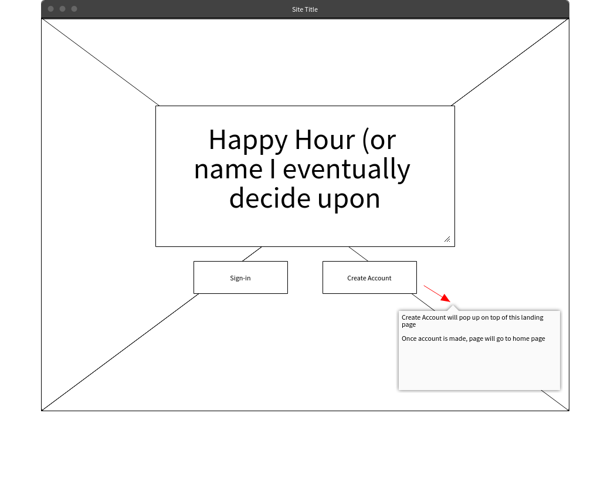
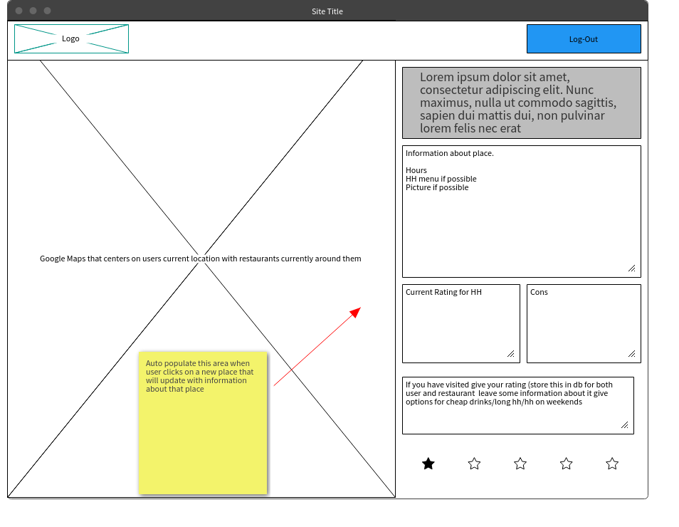

## Happy + Hour(s)

## Git Hub
https://github.com/weshebert20/happy-hour

## Trello Board

Link to trello board:
https://trello.com/b/1bfhJuAf/happy-hours

## Wireframe Login Page

Landing page:

## Wireframe Home Page

Home Page:

## IDEA

Ultimately the idea is to have an app that users can come to to quickly see a places happy hour hours. I find that a lot of time when I am looking for a happy hour around me I struggle finding the information I need I have to jump through hoops. The goal is for restaurant owners to be able to log in to update their hours.

From my wireframes I ended up diverting from the map idea and instead of using googleplaces API I went with ZOMATO. So now the user can search zipcode if they want to find places around their area or use a specific restaurant selection and it will pull up the closest options

## TECHNOLOGY USED

### Installation

I used Node.js to install my modules which included
	- facebook
	- google
	- express
	- body-parser
	- passport
	- ejs
Once installed I broke them up into my back end and front-end. I used my routes early on to check to make sure they were working and to get an understanding of how my app would flow. 

### EJS/CSS

I used basic HTML5 and CSS to give the pages style. I tried to dive deep into the styling of making it look as professional as possible. I used EJS to render my pages dynamically with my external API

### API

The API I ended up using was tricky. This API needed a key but I could not include it in my URL. I had to store the URL I wanted and the KEY in an options variable and get what the user searches on the front end into the back end and then into the variables URL

### jQuery

I used jquery on the front end to to make AJAX calls when needed. I also used it for a few styling touches

### MVC

I used the views folder to store my EJS files, my models were the user which I used Facebook and Google with passport to authorize the user. I also had a Restaurant model to store the information from the external API when user pressed save to my database on MONGO. 

### CHALLENGES

The biggest challenge I ran into was getting the information the user searched on the front-end into my back end URL. As said before the URL could not include the "key" to had to be stored in a "header" with the URL I wanted to search with what the user put in. It created a process of front-end->back-end->externalAPI->back-end->front end with results. All while dealing with that URL/Key issue above. I ended up creating a function that found the object params I wanted and stored them, then added that function to the post request.

My other big challenge was making a for loop in the ejs file that went created the board under the search with live information. Once I figured it out it all made sense, it just took me awhile to get there. I basically had to add ejs IDs to every element on the card deck.

### More to come

1.) Set up the log-out button
2.) when a user saves or deletes create a modal that lets the user know its saved or deleted
3.) have the page search my database before resorting the oter API if I already have the id information 
4.) add a put if it is demanded of me
5.) make mocha test
